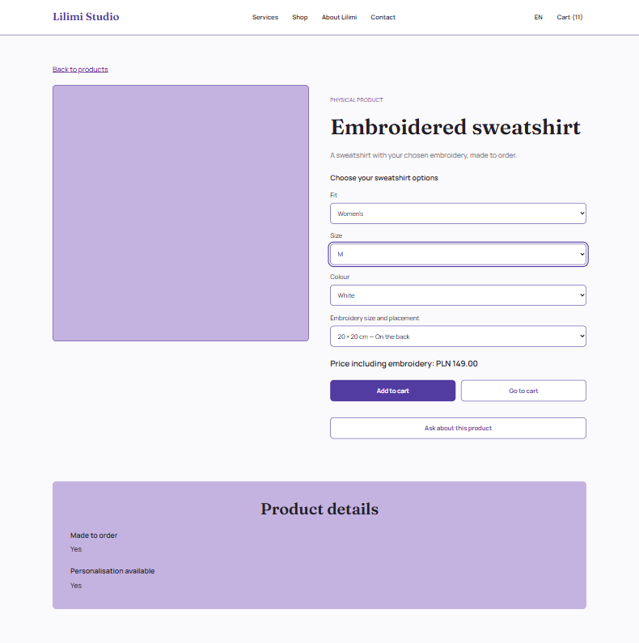
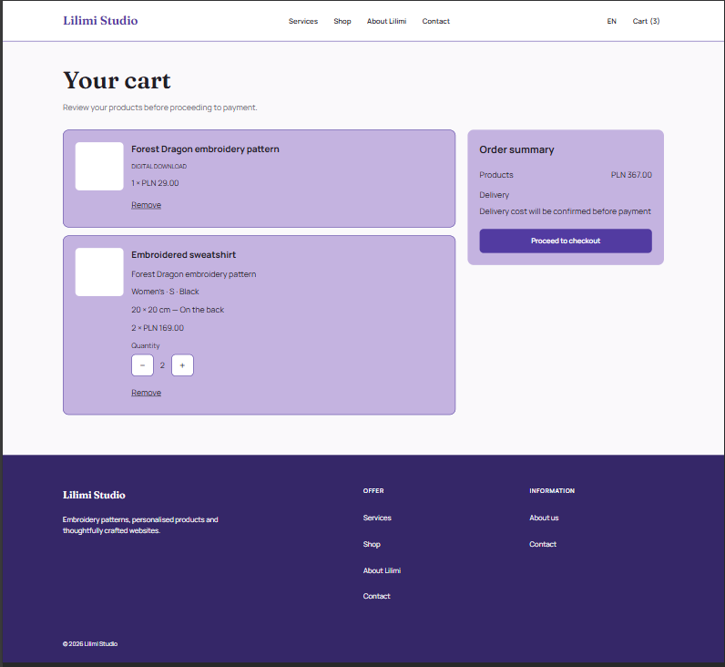
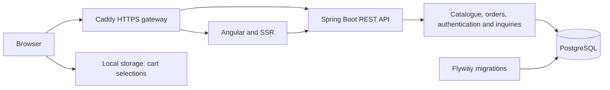

# Lilimi Studio

**A full-stack studio website and e-commerce application for digital embroidery patterns, embroidered clothing, and custom projects.**

I am building Lilimi Studio for my own planned business. The application combines a product shop with project inquiries for custom embroidery and web development work.

I develop both the Angular frontend and Spring Boot backend, including database migrations, integration tests, administrator tools, and deployment on AWS.

**Angular 22 · Java 21 · Spring Boot 4 · PostgreSQL 17**

[Live demo](https://lilimistudio.com) · [Features](#what-works-today) · [Engineering decisions](#engineering-decisions) · [Run locally](#run-locally) · [Next milestones](#next-milestones)

> **Demo application under active development.** Orders and project inquiries are stored in the database, but payments, order fulfilment, transactional emails, and digital file delivery are not implemented. Use fictional contact details when testing.


## What works today

### Studio website

- Responsive homepage, service pages, about page, and contact page.
- Polish and English interfaces using Transloco.
- English as the default language for the root URL.
- Responsive navigation with a mobile menu and cart quantity badge.
- Shared layout with a footer that stays at the bottom of short pages.

### Catalogue and cart

- API-backed product catalogue with category filtering, sorting, and a “show more” interaction.
- Product details, file formats, and related products loaded from the backend.
- Sweatshirt configuration by fit, size, colour, and embroidery option.
- Available combinations and variant-specific prices supplied by the API.
- Mixed carts containing digital patterns and physical products.
- Quantity controls, item removal, and persistence across page reloads.
- Loading, retry, and unavailable-item states.
- Saved cart selections preserved during temporary catalogue failures.

### Checkout and orders

- Contact validation and delivery details for physical products.
- Digital-only checkout without a delivery address.
- Courier selection and order review.
- Order submission and persistence in PostgreSQL.
- Server-side validation of products, configurations, quantities, and prices.
- Order items stored as snapshots of the purchased configuration and price.
- Idempotency keys to prevent duplicate orders when the same submission is retried.
- Server confirmation with an order reference.
- Cart cleared after a successful submission and preserved when submission fails.

Delivery currently uses fixed demonstration rates for Poland. No payment is collected.

### Project inquiries

- Inquiry form for embroidered products, embroidery digitizing, websites, and other projects.
- Optional product context passed from a product page.
- Frontend and backend validation.
- Optional inspiration URL.
- Inquiries stored in PostgreSQL with a reference returned to the visitor.
- Loading, submission, and error states.

Submitting an inquiry does not create an order or send an email.

### Administrator tools

- Administrator login and logout using server-side sessions.
- Role-based access enforced by the backend.
- Protected Angular routes.
- Paginated order list and detailed order views.
- Order status updates with validated transitions.
- Optimistic locking to detect conflicting order updates.
- Paginated inquiry list and detailed inquiry views.
- Handling for expired sessions, access errors, and failed requests.
- Inquiry status updates with validated transitions and optimistic locking.
- Paginated product list including active and hidden products.
- Product visibility updates with confirmation and optimistic locking.
- Editing Polish and English product names and descriptions with validation and optimistic locking.

## A closer look

The shop flow is:

**Catalogue → product configuration → cart → checkout → stored order → administrator review**



Available garment combinations come from the API. The selected configuration determines the price and is retained in the cart and order.



Digital and physical items share a subtotal. Physical items retain their individual configuration and quantity and require delivery details.


The interface supports mobile browsing, product configuration, checkout, and administrator views.

### Design process

- [UI designs — Figma (Polish)](https://www.figma.com/design/sIEFBWbYgUeox8HFAzdfSK/Lilimi-Studio---UX-UI-Design?node-id=1-2&t=JX1Vs5xUUwrYHqwn-1)
- [Sitemap and user flows — FigJam (Polish)](https://www.figma.com/board/cihOaxBQda1CJVEy0FxpWV/Lilimi-Studio---Sitemap---User-Flows?node-id=0-1&t=cGEjnJFJ3WfLNDon-1)

These files document the initial concept and planned journeys. Some designs and screenshots reflect earlier stages of the application.

## Engineering decisions

| Decision | Reason |
| --- | --- |
| Prices use integer grosz amounts | `14900` represents PLN 149.00, avoiding decimal currency arithmetic. |
| Catalogue and variant prices are separate | A garment's “from” price differs from the price of a selected configuration. |
| Cart selections are separate from fetched product data | Temporary API failures must not erase selections or turn unknown prices into zero. |
| The backend calculates order prices | Order totals do not depend on prices supplied by the browser. |
| Orders store item snapshots | Stored orders retain the product configuration and price used at submission. |
| Order submission uses idempotency keys | Retrying an identical submission can return the existing order instead of creating another. |
| Order updates use optimistic locking | Concurrent administrator updates are detected rather than silently overwriting each other. |
| Authentication uses server-side sessions | Authentication tokens are not stored in browser local storage. |
| State-changing requests use CSRF protection | Session-based authentication is paired with CSRF token validation. |
| Flyway owns schema changes | Database structure and seed data use versioned migrations. |
| Integration tests use PostgreSQL containers | Database behaviour is tested against PostgreSQL rather than an in-memory substitute. |

## Architecture



| Area | Tools |
| --- | --- |
| Frontend | Angular 22, TypeScript, signals, Signal Forms, RxJS, SCSS, Transloco, Angular SSR |
| Backend | Java 21, Spring Boot 4.1.1, Spring Security, Spring Data JPA, Hibernate, Maven |
| Database | PostgreSQL 17, Flyway |
| Tests | Vitest, Angular TestBed, JUnit, MockMvc, Testcontainers |
| Deployment | AWS Lightsail, Docker Compose, Caddy, HTTPS |

## Code tour

- [Product API mapping](src/app/features/products/product-api.mapper.ts) — mapping backend responses to frontend product models.
- [Cart service](src/app/features/cart/cart.service.ts) — persistence, availability, and totals.
- [Checkout](src/app/features/checkout) — order review, submission, and error handling.
- [Order pricing](backend/src/main/java/pl/lilimi/order/application/OrderPricingService.java) — server-side pricing.
- [Order submission](backend/src/main/java/pl/lilimi/order/application/OrderSubmissionService.java) — idempotent submission.
- [Administrator order status service](backend/src/main/java/pl/lilimi/order/application/admin/AdminOrderStatusService.java) — status transitions and version checks.
- [Project inquiry service](backend/src/main/java/pl/lilimi/inquiry/application/ProjectInquiryService.java) — validation and persistence.
- [Administrator views](src/app/features/admin) — order and inquiry lists and details.
- [Database migrations](backend/src/main/resources/db/migration) — schema and seed data.

```text
src/app/
├── core/          # API configuration, authentication and translations
├── features/      # Studio pages, products, cart, checkout, inquiries and admin
├── layout/        # Shared layout and navigation
├── shared/        # Reusable interface components
└── testing/       # Test providers and fixtures

backend/
├── src/main/java/pl/lilimi/
│   ├── auth/      # Sessions and administrator account provisioning
│   ├── catalog/   # Products and garment variants
│   ├── inquiry/   # Public inquiries and administrator queries
│   ├── order/     # Submission, pricing and administrator operations
│   └── security/  # Access rules and CSRF configuration
├── src/main/resources/
├── src/test/java/
├── compose.yaml   # Database-only local development stack
└── pom.xml
```

## Run locally

Prerequisites: **Node.js 24, npm, JDK 21, and Docker with Linux containers**.

Maven Wrapper is included. The commands below use Windows PowerShell and start from the repository root.

### 1. Configure and start PostgreSQL

```powershell
cd backend
Copy-Item .env.example .env
Copy-Item src/main/resources/application-local.properties.example src/main/resources/application-local.properties
```

Copy these files only during first-time setup. Replace the password placeholders in both copied files with the same local password. Local configuration files are ignored by Git.

```powershell
docker compose up -d --wait
```

PostgreSQL is exposed on `127.0.0.1:15432` and uses a persistent Docker volume. Changing the environment file does not reset the password in an existing database volume.

### 2. Start the backend

From `backend`, confirm that Maven uses JDK 21:

```powershell
.\mvnw.cmd -version
.\mvnw.cmd spring-boot:run "-Dspring-boot.run.profiles=local"
```

Flyway applies pending migrations on startup.

Health check: [localhost:8080/actuator/health](http://localhost:8080/actuator/health).

### 3. Start the frontend

In another terminal, from the repository root:

```powershell
npm ci
npm start
```

Open [localhost:4200/en](http://localhost:4200/en) or [localhost:4200/pl](http://localhost:4200/pl).

The development proxy forwards browser `/api` requests to the backend. Server-rendered requests use `BACKEND_API_URL`, defaulting to `http://127.0.0.1:8080/api`.

## API

| Method | Endpoint | Purpose |
| --- | --- | --- |
| GET | `/api/products` | Active product catalogue |
| GET | `/api/products/{slug}` | Product details |
| GET | `/api/products/{slug}/variants` | Available garment configurations |
| GET | `/api/auth/csrf` | Initialize the CSRF token |
| POST | `/api/auth/login` | Sign in |
| POST | `/api/auth/logout` | Sign out |
| GET | `/api/auth/me` | Current authenticated user |
| POST | `/api/orders` | Submit an order |
| POST | `/api/project-inquiries` | Submit a project inquiry |
| GET | `/api/admin/orders` | Paginated order list |
| GET | `/api/admin/orders/{id}` | Order details |
| PATCH | `/api/admin/orders/{id}/status` | Update an order status |
| GET | `/api/admin/project-inquiries` | Paginated inquiry list |
| GET | `/api/admin/project-inquiries/{id}` | Inquiry details |
| GET | `/actuator/health` | Application health |
| PATCH | `/api/admin/project-inquiries/{id}/status` | Update an inquiry status |
| GET | `/api/admin/products` | Paginated administrator product list |
| PATCH | `/api/admin/products/{id}/visibility` | Update product visibility |
| GET | `/api/admin/products/{id}` | Administrator product details and translations |
| PATCH | `/api/admin/products/{id}/translations` | Update Polish and English product translations |

Administrator endpoints require the `ADMIN` role. State-changing requests require a valid CSRF token. Order submission also uses an `Idempotency-Key` header.

Try `forest-dragon` for a digital pattern and `embroidered-sweatshirt` for a physical product.

## Verification

Frontend, from the repository root:

```powershell
npm test -- --watch=false
npm run build
```

Backend, from `backend`, with Docker running:

```powershell
.\mvnw.cmd verify
```

Backend integration tests create a separate PostgreSQL container and apply migrations. They do not use the development database.

Tests cover catalogue and cart behaviour, checkout validation, order submission and idempotency, authentication and CSRF, administrator access, order status conflicts, and inquiry submission.

Administrator inquiry details component tests are currently marked as TODO and remain to be implemented.

## Deployment

The demonstration application runs on **AWS Lightsail** at [lilimistudio.com](https://lilimistudio.com).

Docker Compose runs:

- PostgreSQL;
- the Spring Boot backend;
- the Angular SSR frontend;
- Caddy as the HTTPS gateway.

The backend and database are not directly exposed through public host ports.

Deployment currently uses locally built Docker images transferred to the server. Database backups are taken before deployment, and container health checks verify application startup.

Automated testing, image publishing, and deployment through GitHub Actions are the next infrastructure milestone.

### Run the complete stack locally

The root Compose configuration runs the complete application:

```powershell
Copy-Item .env.example .env
```

For first-time setup, replace the database password placeholder. Keep an existing `.env` rather than overwriting it.

```powershell
docker compose up -d --build --wait
```

Open [localhost:8088/en](http://localhost:8088/en).

This stack uses a separate database volume from the database-only development stack in `backend`.

## Next milestones

- Complete administrator inquiry details tests and update remaining demo copy.
- Introduce GitHub Actions for tests, Docker image publishing, and deployment.
- Add editing of product translations, prices, and garment variants.
- Implement customer registration, login, and order history.
- Add email verification, password recovery, and transactional emails.
- Integrate payments and controlled delivery of purchased digital files.
- Replace visual placeholders with original assets and portfolio work.

The current application is a working demonstration of the shop and administrator workflows, rather than a production-ready store.