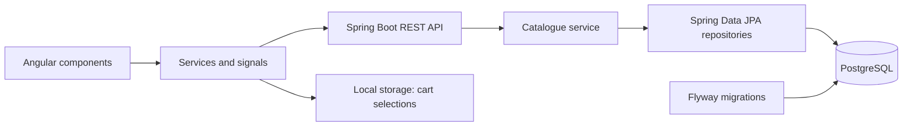

# Lilimi Studio

**A graphic design and web development studio with an integrated shop for digital embroidery patterns and embroidered clothing.**

I am building Lilimi for my own planned studio. The project brings together two parts of that business: discussing custom design and development work, and buying ready-made products. It is also where I practise building an application across Angular, Java and PostgreSQL—from interface behaviour to database migrations and integration tests.

Angular 22 · Java 21 · Spring Boot 4 · PostgreSQL 17

[Live demo](https://lilimistudio.com) · [What works](#what-works-today) · [Engineering decisions](#engineering-decisions) · [Code tour](#code-tour) · [Run locally](#run-locally)

> **In development.** The catalogue, product details, clothing variants and cart use the backend API. Checkout currently validates customer details and displays an order review; it does not submit orders or take payments. The public demo is available at [lilimistudio.com](https://lilimistudio.com).


## What works today

### Studio website

- Responsive homepage introducing graphic design, UX/UI and web development services.
- Polish and English interfaces with Transloco.
- About and contact pages, plus a project inquiry form with client-side validation. The inquiry form is being adapted to the expanded service offer.

### Shop

- API-backed product catalogue with category filtering, sorting and a “show more” interaction.
- Product details, file formats and related products loaded from the API.
- Sweatshirt configuration by fit, size, colour and embroidery option, using available backend variants.
- Variant-specific prices shared by the configurator and cart.
- Cart quantity controls, removal and persistence across page reloads.
- Digital product IDs and garment configurations stored locally; current product information and prices fetched from the backend.
- Loading, retry and unavailable-item states. A failed catalogue request does not erase saved cart IDs, and incomplete pricing prevents checkout progression.
- Checkout contact/address validation, courier selection and an order review. Delivery currently uses illustrative rates for Poland.

## A closer look

The main demonstration flow is **catalogue → product → configuration → cart → checkout review**.


**Configuration:** available combinations come from the API. A size must be selected before the item can be added; valid selections are preserved when other options change.


**Mixed cart:** digital patterns and physical items share a subtotal, while physical items retain their individual configuration and quantity.


**Mobile:** service cards stack vertically and navigation moves into a separate menu.

### Design process

- [UI designs — Figma (Polish)](https://www.figma.com/design/sIEFBWbYgUeox8HFAzdfSK/Lilimi-Studio---UX-UI-Design?node-id=1-2&t=JX1Vs5xUUwrYHqwn-1)
- [Sitemap and user flows — FigJam (Polish)](https://www.figma.com/board/cihOaxBQda1CJVEy0FxpWV/Lilimi-Studio---Sitemap---User-Flows?node-id=0-1&t=cGEjnJFJ3WfLNDon-1)

These files document the initial concept and planned user journeys.
Some flows describe features that are not implemented yet.
The application is evolving towards a service-first studio website,
so the design documentation is being updated alongside development.

## Engineering decisions

| Decision | Reason |
| --- | --- |
| Prices use integer grosz amounts | Monetary values travel through the API without decimal currency arithmetic. `14900` represents PLN 149.00. |
| Catalogue price and variant price are separate | A garment's “from” price is the minimum active variant price. The selected configuration has its own price. |
| Saved cart selection is separate from fetched data | Temporary API failures must not silently delete a customer's selections or turn an unknown price into zero. |
| Backend responses are mapped to frontend product models | API product types and the interface's product categories serve different purposes. The mapping is explicit. |
| Flyway owns schema changes | Database structure and seed data are reproducible through versioned migrations. |
| Backend integration tests use PostgreSQL containers | Repository queries and migrations are tested against PostgreSQL rather than a substitute in-memory database. |

Prices displayed by the frontend are not yet a completed order-pricing mechanism. Server-side validation and recalculation when submitting an order are planned before real sales.

## Architecture



| Layer | Tools |
| --- | --- |
| Frontend | Angular 22, TypeScript, signals, RxJS, SCSS, Transloco, Angular SSR |
| Backend | Java 21, Spring Boot 4.1.1, Maven, Spring Data JPA, Hibernate |
| Database | PostgreSQL 17, Flyway |
| Tests | Vitest, Angular TestBed, JUnit, MockMvc, Testcontainers |
| Local environment | Docker Compose for PostgreSQL, Maven Wrapper |

## Code tour

Useful starting points for reviewing the implementation:

- [Product API mapping](src/app/features/products/product-api.mapper.ts) — translation between the API response and frontend product models.
- [Shared variant state](src/app/features/products/sweatshirt-variants.service.ts) — loading, error handling and retry for garment variants.
- [Cart service](src/app/features/cart/cart.service.ts) — persistence, availability and totals.
- [Cart tests](src/app/features/cart/cart.service.spec.ts) — API price changes, unavailable variants and persistence during failed requests.
- [Product service](backend/src/main/java/pl/lilimi/catalog/ProductService.java) — assembly of catalogue responses from product, translation, price and specification data.
- [API integration tests](backend/src/test/java/pl/lilimi/catalog/ProductControllerTest.java) — product lookup, unavailable products and garment variants.
- [Database migrations](backend/src/main/resources/db/migration) — schema and initial catalogue data.

```text
src/app/
├── core/          # API configuration and translations
├── features/      # Home, services, products, cart, checkout and inquiries
├── layout/        # Shared layout and navigation
├── shared/        # Reusable interface components
└── testing/       # Test providers and fixtures
backend/
├── src/main/java/pl/lilimi/  # Application and catalogue backend
├── src/main/resources/      # Configuration and Flyway migrations
├── src/test/java/           # Backend tests
├── compose.yaml            # Local PostgreSQL service
└── pom.xml
```

## Run locally

Prerequisites: **Node.js compatible with Angular 22, npm, JDK 21 and Docker with Linux containers**. Maven Wrapper is included. The commands below use Windows PowerShell and start from the repository root.

### 1. Configure and start the database

```powershell
cd backend
Copy-Item .env.example .env
Copy-Item src/main/resources/application-local.properties.example src/main/resources/application-local.properties
```

Run these copies only for first-time setup. Replace the password placeholders in both copied files with the same local password. Real local configuration files are ignored by Git.

```powershell
docker compose up -d --wait
```

PostgreSQL is exposed on `127.0.0.1:15432` and uses a persistent Docker volume. Changing the environment file does not reset the database password in an existing volume.

### 2. Start the backend

From `backend`, check that Maven uses JDK 21 and start the local profile:

```powershell
.\mvnw.cmd -version
.\mvnw.cmd spring-boot:run "-Dspring-boot.run.profiles=local"
```

Flyway applies pending migrations on startup. Health check: [localhost:8080/actuator/health](http://localhost:8080/actuator/health).

### 3. Start the frontend

In another terminal, from the repository root:

```powershell
npm ci
npm start
```

Open [localhost:4200/pl](http://localhost:4200/pl) or [localhost:4200/en](http://localhost:4200/en).

The development proxy forwards browser `/api` requests to the backend. Server-rendered requests use `BACKEND_API_URL`, defaulting to `http://127.0.0.1:8080/api`.

## API

| Method | Endpoint | Purpose |
| --- | --- | --- |
| GET | `/api/products` | Active catalogue products with available prices |
| GET | `/api/products/{slug}` | Product details and specifications |
| GET | `/api/products/{slug}/variants` | Available garment configurations and prices |
| GET | `/actuator/health` | Application health |

Try `forest-dragon` for a digital pattern and `embroidered-sweatshirt` for a physical product. Unknown or unavailable products return HTTP 404.

## Verification

Frontend, from the repository root:

```powershell
npx ng test --watch=false
npm run build
```

Backend, from `backend`, with Docker running:

```powershell
.\mvnw.cmd verify
```

Backend integration tests create a separate PostgreSQL container and apply the migrations; they do not use the development database. Frontend component and service tests use controlled API responses and test providers.

Examples of behaviour covered by tests include changing product routes, retrying failed requests, reacting to variant price changes, blocking unavailable configurations, and preserving cart IDs while the catalogue is unavailable.

## Next milestones

- Adapt the inquiry form to graphic design, UX/UI and web development services, with embroidery digitization inside the graphic design offer.
- Add portfolio work and replace visual placeholders with original project assets.
- Publish an explicitly labelled AWS demonstration environment.
- Implement order submission, server-side price validation and persistence.
- Integrate payments, transactional emails and controlled delivery of purchased digital files.

The current code also retains some embroidery-specific assumptions, including local option metadata used in cart descriptions. These will be revisited as the catalogue and ordering workflow expand.


## Run the whole application with Docker

The root Compose stack runs Angular SSR, Spring Boot, PostgreSQL and a Caddy gateway.
See [Docker setup and demo deployment](deploy/README.md) for configuration, startup and AWS preparation.
The database-only development stack remains available in backend/compose.yaml.
